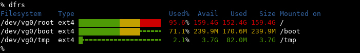

# dfrs

*dfrs* displays the amount of disk space available on the file system
containing each file name argument. If no file name is given, the space
available on all currently mounted file systems is shown.

*dfrs*(1) is a tool similar to *df*(1) except that it is able to show a graph
along with the data and is able to use colors.

Without any argument, size is displayed in human-readable format.

## Installation

    cargo install dfrs

### Arch Linux

    pacman -S dfrs

### Debian sid/bullseye

    apt install dfrs

### Alpine (edge, 3.13)

    apk add dfrs

## License

MIT
